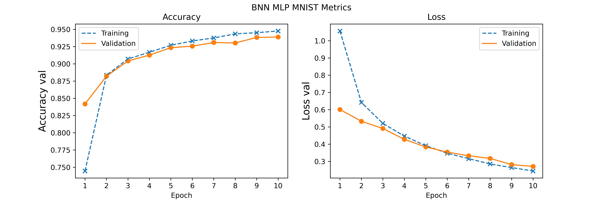
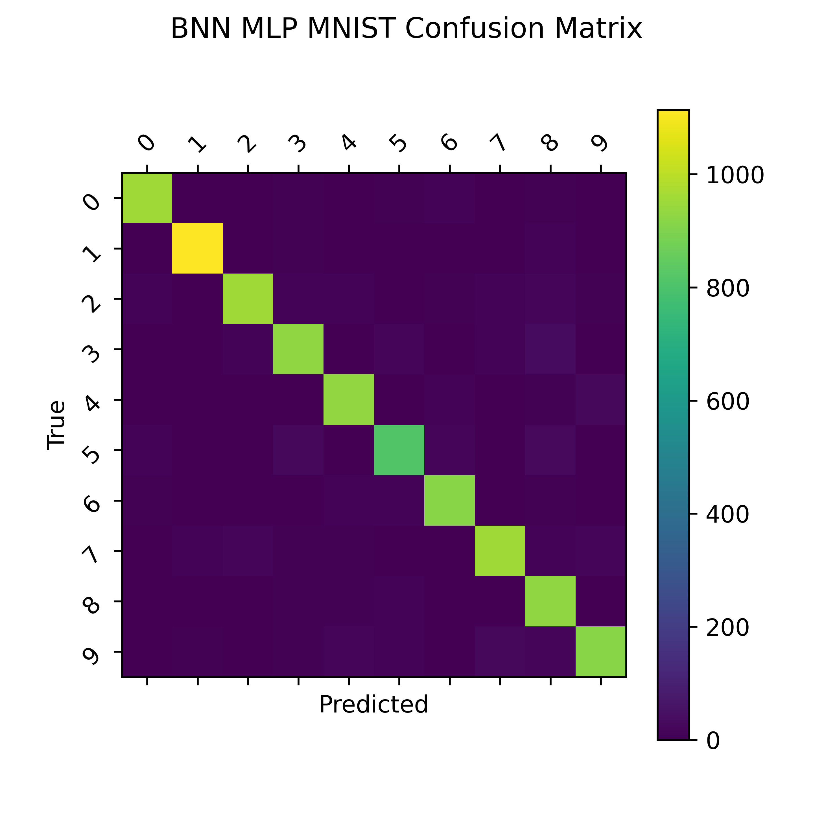

# Binarized Neural Networks (BNNs) Implementation

[![DeepWiki](https://img.shields.io/badge/DeepWiki-introduce-blue.svg?logo=)](https://deepwiki.com/ittuann/Binarized-Neural-Networks)

This repository provides implementations of Binarized Neural Networks (BNNs) using TensorFlow 2 and PyTorch, along with additional inference support in Numpy and pure C.

Binarized Neural Networks are a type of deep learning model, which **weights and activations are constrained to 1-bit binary values, typically -1 and +1**, instead of conventional 32-bit floating-point values. And this let most floating-point multiplications and additions be replaced with efficient bitwise XNOR and popcount operations.

BNNs approach dramatically reduces memory usage and computational requirements of neural networks, while also enabling significantly faster inference.

These advantages make BNNs highly suitable for real-time on-device deployment on a wide range of the most common devices, including mobile phones, robotics platforms, IoT systems, and industrial microcontroller applications.

In addition, I also provide a deployment example of BNNs implemented on STM32-F411CEU6 MCU running at 100 MHz (0.1 GHz), using pure C code for inference, and it takes only 1.3 ms per image on MNIST datasets, with an overall accuracy rate of 93.89%: https://github.com/ittuann/STM32-Binarized-Neural-Networks
And there is also a BNNs implementation in Unity Engine using C# and Compute Shader: https://github.com/ittuann/Unity-Binarized-Neural-Networks

# TensorFlow 2 Implementation

The TensorFlow 2 BNNs implementation is built using the Keras API.

## Usage

Take an MLP-based BNN trained on MNIST dataset as an example. Import the `BinaryDense` layer from `bnn_layers` and use it as follows:

```python
from bnn_layers import BinaryDense

model = tf.keras.models.Sequential(
    [
        tf.keras.layers.Flatten(input_shape=(28, 28)),
        BinaryDense(128, use_bias=is_use_bias, epsilon=epsilon, momentum=momentum, is_binarized_activation=False),
        BinaryDense(64, use_bias=is_use_bias, epsilon=epsilon, momentum=momentum),
        BinaryDense(10, use_bias=is_use_bias, epsilon=epsilon, momentum=momentum),
    ]
)
```

For a complete implementation example, please refer to `tensorflow2/BNN_MLP_MNIST_example.ipynb`.

You can also build CNN architectures in a similar way by using the `BinaryConv2D` layer.

## Results

The following example shows the binarized weights of the trained model:

```python
for i, layer in enumerate(model.layers):
    if isinstance(layer, BinaryDense):
        binarized_weights = layer.get_binarize_weights()
        print(f"Layer {i} Name: {layer.name}, Inference used binarized Weights:")
        print(binarized_weights, "\n")
```

Outputs:

```plaintext
Layer 1 Name: binary_dense, Inference used binarized Weights:
tf.Tensor(
[[-1  1  1 ... -1 -1  1]
 [-1 -1  1 ...  1 -1 -1]
 ...
 [ 1 -1 -1 ... -1  1  1]
 [ 1  1 -1 ... -1  1  1]], shape=(784, 128), dtype=int8)

Layer 2 Name: binary_dense_1, Inference used binarized Weights:
tf.Tensor(
[[-1  1 -1 ...  1 -1  1]
 [-1  1 -1 ...  1 -1 -1]
 ...
 [-1 -1 -1 ...  1  1 -1]
 [ 1 -1 -1 ...  1 -1 -1]], shape=(128, 64), dtype=int8)

 Layer 3 Name: binary_dense_2, Inference used binarized Weights:
tf.Tensor(
[[-1  1  1  1  1 -1 -1 -1 -1  1]
 [ 1 -1 -1  1  1 -1  1  1  1  1]
 ...
 [ 1  1 -1 -1 -1 -1 -1  1  1 -1]
 [ 1 -1 -1  1  1  1  1  1 -1 -1]], shape=(64, 10), dtype=int8)
```

## Evaluation






# PyTorch Implementation

BNNs are also implemented using PyTorch.

Usage: Simply import the `BinarizeLinear` and `BinarizeConv2D` layers from `bnn_layers`.

# eBNNs TensorFlow 2 Implementation

Embedded Binarized Neural Networks (eBNNs) are also implemented using TensorFlow 2 Keras.

# Inference in Numpy

NumPy-based inference functionality is included in the eBNNs TensorFlow 2 implementation examples.

# Inference in C

For C-based or bare-metal execution, It can be simply compile the provided C code directly and run it directly. Two examples are included: `one_batch_example`, `two_layers_example`.

# Paper

Original Paper:

```plaintext
Hubara, I., Courbariaux, M., Soudry, D., El-Yaniv, R., & Bengio, Y. (2016). Binarized neural networks. Advances in neural information processing systems, 29.

Courbariaux, M., Bengio, Y., & David, J. P. (2015). Binaryconnect: Training deep neural networks with binary weights during propagations. Advances in neural information processing systems, 28.

McDanel, B., Teerapittayanon, S., & Kung, H. T. (2017). Embedded binarized neural networks. arXiv preprint arXiv:1709.02260.
```

Recommended reading & future works:

```plaintext
Nielsen, J., & Schneider-Kamp, P. (2024, July). BitNet B1. 58 Reloaded: State-of-the-Art Performance Also on Smaller Networks. In International Conference on Deep Learning Theory and Applications (pp. 301-315). Cham: Springer Nature Switzerland.

Wang, H., Ma, S., Dong, L., Huang, S., Wang, H., Ma, L., ... & Wei, F. (2023). Bitnet: Scaling 1-bit transformers for large language models. arXiv preprint arXiv:2310.11453.

Kim, M., & Smaragdis, P. (2016). Bitwise neural networks. arXiv preprint arXiv:1601.06071.
```
